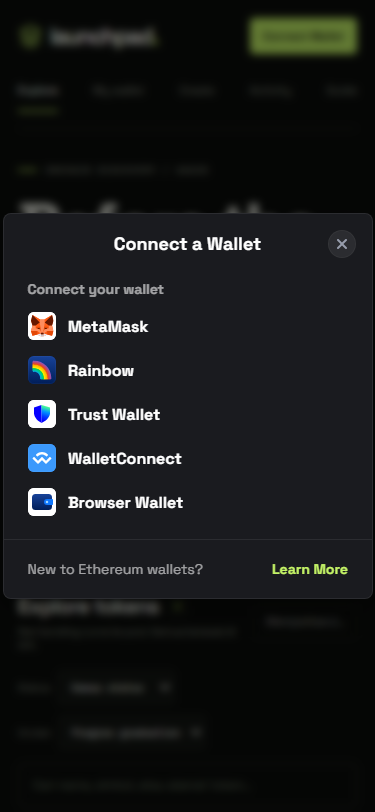

# Launchpad — Robinhood Chain Testnet

**Live dApp:** [technical-test.dea.web.id](https://technical-test.dea.web.id/) · **Repository:** [deamyasin/technical-test-web3](https://github.com/deamyasin/technical-test-web3)

dApp React untuk discovery token, buy/sell bonding curve, launch token, profil wallet, aktivitas, dan graduation melalui RainbowKit + Wagmi + WalletConnect. Dibuat untuk brief technical test fullstack Web3 enam jam.

## Menjalankan

Prasyarat: Node.js 20.19+ atau 22.12+, npm, dan wallet EVM (extension atau aplikasi mobile).

```bash
npm ci
cp .env.example .env.local
npm run dev
```

Buka URL yang ditampilkan Vite (default `http://localhost:5173`). Buat wallet baru khusus tes, connect wallet, lalu gunakan tombol pindah network jika diperlukan. Aplikasi menambahkan Robinhood Chain Testnet jika belum tersedia. Ambil ETH dari [faucet](https://faucet.testnet.chain.robinhood.com/); jika gagal, minta pengawas mengirim ke alamat wallet tes.

```bash
npm run build
npm run preview
```

Untuk koneksi aplikasi mobile/QR, buat Project ID publik di [Reown Dashboard](https://dashboard.reown.com), salin `.env.example` ke `.env.local`, lalu isi (contoh sudah memuat Project ID publik project ini):

```dotenv
VITE_WALLETCONNECT_PROJECT_ID=<project-id-publik-32-karakter-hex>
```

Tambahkan `https://technical-test.dea.web.id` dan origin development pada allowlist project. Restart Vite atau build ulang setelah mengubah env; env Vite ditanam saat build. Project ID ini publik, bukan private key wallet. Tanpa ID valid, modal tetap mendeteksi injected/EIP-6963 (termasuk browser aplikasi MetaMask), tetapi QR/deep link WalletConnect tidak diaktifkan. Tautan “Buka di MetaMask” tersedia sebagai fallback mobile. Safari/Chrome mobile tidak dapat mendeteksi seluruh aplikasi terpasang secara langsung; koneksi dilakukan lewat WalletConnect atau browser internal wallet.

Tidak memerlukan private key atau backend. Semua transaksi ditandatangani wallet pilihan pengguna. Jangan memasukkan seed/private key ke source atau repository.

Jika berpindah Windows ↔ WSL/Linux, jalankan `npm ci` pada platform tujuan. Dependency native Vite/Rollup/esbuild harus cocok dengan sistem operasi. Jangan menjalankan install bersamaan dengan build/deployment agent lain.

## Keputusan teknis

- **Vite + React + viem + Wagmi + RainbowKit:** sesuai kebutuhan satu chain; tidak memerlukan server atau kontrak baru. ABI lengkap terlampir disimpan di `src/web3/abi`, sehingga signature fungsi/event/error mengikuti brief.
- **Discovery dari event `TokenLaunched`:** sejak blok `129157568`, rentang inklusif maksimal 50.000 blok, maksimal tiga request log bersamaan, dedupe berdasarkan alamat. Alamat token contoh tidak di-hardcode. **Hanya pair ETH (`address(0)`) yang ditampilkan**, karena pair ERC-20 memerlukan unit harga dan alur pembayaran/approval berbeda.
- **Multicall3 `allowFailure`:** metadata diberi fallback; kegagalan data wajib transaksi memblokir buy. Pembacaan metadata/reserve/fee/phase menggunakan satu snapshot block per refresh. Viem dapat memecah batch sesuai batas ukuran calldata; tidak diasumsikan selalu tepat satu RPC request.
- **RPC:** endpoint resmi Robinhood digunakan terlebih dahulu, dengan fallback otomatis ke publicnode jika request gagal. URL dan parameter chain ada di `src/web3/chain.js`.
- **Polling 20 detik + refresh manual:** menangkap token baru dan memperbarui token lama karena reserve/phase dapat berubah akibat transaksi orang lain. Cursor disimpan setelah discovery dan pembacaan selesai. Refresh diserialisasi agar request tidak menimpa satu sama lain.
- **Bigint:** input divalidasi sebelum `parseEther`, maksimal 18 desimal. Fee, creator tax, snipe tax, curve output, dan slippage dihitung dengan pembagian floor. Progres dijepit ke 100% sebelum format. Harga memakai presisi tambahan agar harga di bawah satu wei per token tetap terbaca. Format UI bukan nilai yang dikirim ke kontrak.
- **Wallet:** RainbowKit dark/lime; MetaMask, Rainbow, Trust Wallet dan WalletConnect jika Project ID tersedia; discovery EIP-6963 untuk extension, reconnect sesi, account modal, disconnect sungguhan, dan add/switch chain melalui connector terpilih. Semua write memeriksa akun/network provider connector. Respons saldo akun lama diabaikan.
- **Transaksi:** simulasi dan gas diperiksa otomatis setelah input berhenti 450 ms; tombol beli aktif setelah saldo termasuk headroom gas terverifikasi. Simulasi diulang sebelum pengiriman, disertai pemeriksaan akun/network sebelum write, `value = quoteIn`, recipient wallet. State memisahkan pemeriksaan, konfirmasi wallet, pending, sukses, gagal, dan status receipt yang belum diketahui. Jika receipt belum terbaca, buy tetap dikunci dan tersedia pengecekan ulang tanpa mengirim transaksi kedua.
- **Output aktual:** decode `CurveBuy` dari alamat curve dan recipient yang benar; hash mengikuti replacement transaksi. Estimasi tidak pernah dipakai sebagai output sukses. Sesudah berhasil, data kartu, ETH, dan saldo token diambil ulang tanpa reload.
- **UI:** tema charcoal + acid lime, tipografi Space Grotesk/IBM Plex Mono self-hosted dengan lisensi OFL di `public/fonts`, ilustrasi orbital SVG dekoratif, ringkasan dari data chain, grid kartu desktop, dan panel trading sticky. Mobile memakai satu kolom; memilih kartu membawa pengguna ke form. Placeholder geometris memakai warna deterministik dari alamat. State loading/empty/error, badge semua phase, alasan buy nonaktif, dan link explorer tetap tersedia. Ilustrasi hero tidak merepresentasikan data harga atau prediksi.

## Halaman dan alur dApp

| URL hash | Halaman | Fungsi |
| --- | --- | --- |
| `#/explore` | Explore | Discovery, search, filter phase, sort progress/newest/name, dan buy. |
| `#/wallet` | My wallet | Saldo ETH/token, token pernah dibeli, history buy/sell wallet, explorer. |
| `#/launch` | Create | Launch config 1 pair ETH, nama/ticker/logo/description/website, creator tax 0–10%, buyback. |
| `#/activity` | Activity | Event CurveBuy/CurveSell factory ini, filter buy/sell, search wallet/hash/token, pagination 20. |
| `#/token/<address>` | Token detail | Metadata/creator/fees, aktivitas token, tautan buy, approve/sell, graduation phase 1. |
| `#/guide` | Guide | Alur connect/faucet/discover/buy/sell/launch, arti phase dan fee/slippage. |

Hash routing mendukung bookmark, reload deep link, dan browser back/forward tanpa konfigurasi rewrite hosting tambahan. Halaman transaksi tetap mounted ketika view berpindah; satu transaksi aktif memblokir transaksi lain.

**Launch:** memakai overload tiga argumen, `launchConfigId=1`, pair ETH. `canLaunch`, fee dan expectedEconomics dibaca ulang sebelum transaksi; `value` persis launchFee; salt 32-byte acak baru setiap percobaan; creator recipient default wallet pengirim. Nama/ticker divalidasi 64/16 byte UTF-8. Untuk bonus tes, masukkan nama lengkap kandidat dan ticker TEST. Nama kandidat tidak di-hardcode.

**Sell:** approve curve dengan jumlah tepat jika allowance kurang, tunggu receipt, lalu klik Sell untuk transaksi kedua. Estimasi memakai `gross = tokensIn * quoteReserve / (tokenReserve + tokensIn)`, kemudian fee dan creator tax dipotong dari gross dengan floor bigint sesuai source. `minQuoteOut` menerapkan slippage. Gas/simulasi/account/network diperiksa sebelum setiap write; ETH diterima dibaca dari CurveSell, bukan estimasi.

**Graduation:** hanya token phase 1 yang menawarkan createGraduatedPool; setelah sukses phase dan daftar di-refetch. Token phase 2/3 tidak dapat dibeli/dijual di curve. Aplikasi tidak menyediakan swap pool v4; link explorer tersedia.

Semua transaksi bonus memakai simulation, awaiting-wallet/pending/success/error/unknown receipt + retry, replacement hash, validasi destination receipt, serta pemeriksaan event yang relevan. Source/ABI dan render telah diperiksa; transaksi bonus nyata masih perlu diuji Muse/Luna.

## My wallet / profil

Tab **My wallet** menampilkan identitas wallet, saldo ETH, token yang dimiliki atau pernah dibeli, dan riwayat pembelian. Saldo token dibaca dari `balanceOf` via Multicall3; riwayat dibangun dari event `CurveBuy` dan `CurveSell` sejak deployment dengan recipient wallet. Pengambilan event memakai chunk maksimal 50.000 blok dan concurrency tiga. Cache riwayat hanya di memori dan scoped per account/curves; reload akan mengambil ulang history dari chain.

Saldo saat ini berbeda dari total token pernah dibeli: hasil transfer dapat muncul tanpa history buy, dan token yang ditransfer keluar dapat bersaldo nol meskipun punya history. ETH spent menghitung quote input aktual pada event dengan buyer wallet sendiri, tanpa gas; pembelian hadiah oleh wallet lain tidak dimasukkan ke spent. Tidak menampilkan PNL atau nilai jual yang belum diverifikasi.

Scope profil hanya token pair ETH dari factory tes ini, bukan semua aset wallet atau transaksi pool v4. Tidak ada password/email; wallet menjadi identitas. Profil bisa di-refresh, menangani partial balance failure, dan menjaga tracking transaksi saat pindah view.

Audit requirement inti, bukti yang tersedia, test yang masih perlu dijalankan, dan bonus yang belum tersedia ada di [ACCEPTANCE.md](ACCEPTANCE.md).

## Perbedaan brief dan source verified

Source curve dibaca dari [Sourcify API v2](https://sourcify.dev/server/v2/contract/46630/0x168EA1234652A5dA6bf84D2C1fD243326412B5b2?fields=sources), `src/v2/BondingCurve.sol`.

1. `currentSnipeTaxBps(address recipient)` memberikan pajak yang bergantung pada wallet dan waktu launch. Pajak ini dipotong dari quote input selain fee dan creator tax. Source membatasinya ke `9900 - feeBps - creatorTaxBps`. Estimasi aplikasi memasukkan pajak ini sesuai instruksi bahwa source kontrak menjadi acuan. Untuk token tanpa pajak aktif, rumus sama dengan brief.
2. Dekat graduation, pembelian dapat diisi sebagian dan sisa ETH dikembalikan. Pada kondisi itu kontrak memakai batas harga: `spent * minTokensOut <= received * tokensOut`, bukan jaminan jumlah absolut tanpa mempertimbangkan refund. Form menampilkan penjelasan; jumlah sukses tetap berasal dari event receipt.
3. `SlippageExceeded` memiliki argumen `(uint256 actual, uint256 minimum)` pada ABI terlampir. Decode error memakai signature lengkap.

**Belum dinyatakan sudah dilaporkan kepada pengawas.** Kandidat perlu menyampaikan perbedaan ini pada sesi tes.

## Status verifikasi dan keterbatasan

Implementasi/build dan visual desktop/mobile diperiksa Codex. Luna mencatat discovery 5/5 token, pembelian testnet EARLY 0.002 ETH sukses, serta deployment. Codex juga memverifikasi history profil terhadap receipt pembelian tersebut, saldo token aktual dan dedupe incremental secara read-only. Testing MetaMask UI lengkap, clone baru, dan penyerahan repository tetap memerlukan bukti tambahan dari Muse/Luna. Catatan hasil aktual dicatat bersama di `../log-ai.txt`; jangan menganggap daftar fitur sebagai bukti bahwa testing sudah lolos.

- Launch, sell, detail, activity, sort/filter dan create graduated pool sudah diimplementasikan. Transaksi bonus nyata (launch dengan nama kandidat, approval/sell, phase 1 graduation) belum memiliki bukti testing MetaMask.
- Discovery menggunakan polling dan RPC publik; riwayat sangat panjang akan meningkatkan waktu initial load. Belum ada indexer, persistent cache, atau rekonsiliasi reorg.
- Gas check memakai estimasi dengan headroom 20%; biaya aktual dan state chain dapat berubah sesudah simulasi.
- Output form merupakan estimasi dari snapshot reserve. Receipt menjadi sumber output aktual; refund/partial fill dapat membuat jumlah aktual berbeda.

## Bantuan AI dan demo

Muse AI membuat implementasi awal dan bertanggung jawab atas testing/deployment. Codex mengaudit brief/ABI, memperbaiki discovery dan decoding, mengerjakan matematika/wallet/transaksi/refetch, merapikan UI, serta memperbarui dokumentasi. Kandidat perlu memahami dan memverifikasi semua bagian untuk demo dan sesi perubahan kode.

Screenshot desain terbaru dari aplikasi yang berjalan lokal dengan data chain nyata:

- [Desktop 1440 px](screenshots/web3-desktop.png)
- [Mobile 375 px](screenshots/web3-mobile.png)
- [Profil desktop](screenshots/profile-desktop.png)
- [Profil mobile](screenshots/profile-mobile.png)
- [Create desktop](screenshots/launch-desktop.png) / [mobile](screenshots/launch-mobile.png)
- [Activity desktop](screenshots/activity-desktop.png) / [mobile](screenshots/activity-mobile.png)
- [Token detail desktop](screenshots/token-detail-desktop.png) / [mobile](screenshots/token-detail-mobile.png)
- [Guide desktop](screenshots/guide-desktop.png) / [mobile](screenshots/guide-mobile.png)

Codex memeriksa render dengan Chromium headless: lima kartu tampil dan lebar konten mobile sama dengan viewport 375 px. Screenshot ini menunjukkan UI tanpa wallet terhubung; pengujian MetaMask dan video transaksi tetap ditangani Muse/Luna. Deployment desain baru perlu mengunggah seluruh `dist`, termasuk folder `fonts`.

Screenshot profil menggunakan provider wallet read-only sebagai fixture koneksi, dengan saldo dan event dari chain nyata untuk penerima transaksi Luna. Tidak menggunakan private key dan tidak menandatangani transaksi. Render profil terverifikasi (dua kepemilikan, dua event pembelian, tanpa overflow 375px); fixture ini bukan pengganti pengujian MetaMask asli.

Halaman pendukung juga diuji render dengan provider read-only dan data chain nyata. Encoding launch overload, error factory, parser token precision, invariant round-trip fee, URL safety, dedupe activity dan metadata diperiksa tanpa transaksi write. Deep-link token setelah reload berhasil dan tidak ada runtime exception. Hasil ini bukan bukti transaksi bonus sudah berhasil.

## Verifikasi koneksi mobile (Muse/Luna)

Set Project ID pada environment build lalu deploy seluruh `dist`. Uji Android Chrome dan iOS Safari: Connect Wallet → MetaMask/Rainbow/Trust → buka aplikasi → approve → kembali ke dApp; desktop WalletConnect → scan QR → approve. Uji reconnect setelah reload, ganti akun/network di wallet, disconnect, pembatalan koneksi, lalu buy/approve/sell/launch melalui connector tersebut. Jangan menandai alur handoff sebagai lolos hanya karena modal tampil.

Dependency override `cuer → qr@0.5.4` menjaga kompatibilitas API border=0 untuk QR RainbowKit; qr@0.7.2 menolak border=0 dan menyebabkan modal QR crash. Override `ws@^8.22.0` memperbarui dependency transport dengan versi patch satu major. Jangan menghapus override QR sebelum menguji modal WalletConnect secara langsung.

Verifikasi integrasi wallet: `npm run check:wallet` memeriksa render URI WalletConnect melalui dependency QR asli. Production build lolos; Chromium 375/1440 px menampilkan modal tanpa overflow; layar QR WalletConnect tampil tanpa runtime exception. Provider fixture read-only lolos reconnect reload dan disconnect. Handoff aplikasi Android/iOS serta tanda tangan transaksi mobile nyata tetap memerlukan pengujian Muse/Luna.


